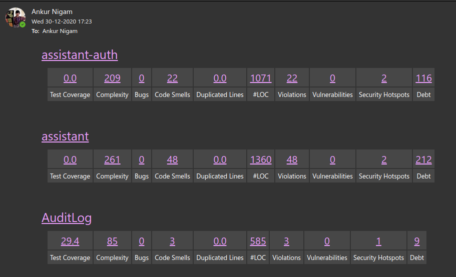

# Sonar Report Mail

A simple python script to email sonarcloud analysis metrics.

_Note:_ This script requires logic app to function properly.

## How to use

To use this script you need to provide some environment variables either in `dotenv` file or set variables in environment

### .dotenv file sample

```dotenv
sonarcloud_url="https://sonarcloud.io/"
sonarcloud_token="YOUR TOKEN"
sonarcloud_organization="ORGANIZATION_NAME"
sonarcloud_projects="Comma separated project names"
LOGICAPP_URL="Logic app post url"
```

## Linking with Azure Logic App

- Logic app should be triggered from `http post` request.
- Do not set any request payload data.
- Send email with `http request body` as dynamic property in body.

